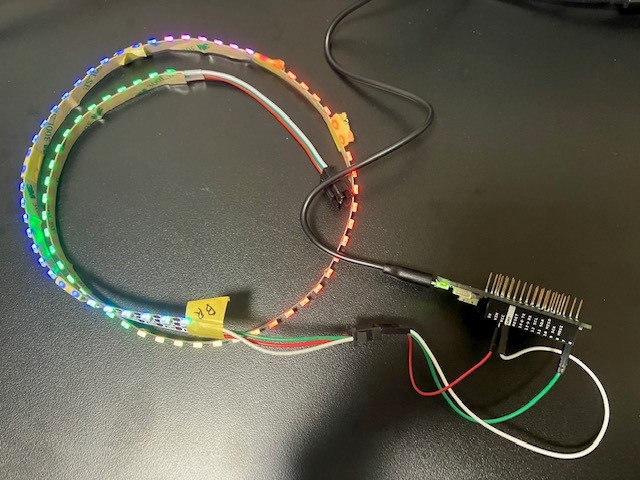

# neopixel_DMA

## Environment
* Arduino MKRZERO
* Arduino 2.0

 

## Dependencies
* Adafruit_ZeroDMA
* Adafruit_NeoPixel_ZeroDMA

https://github.com/adafruit/Adafruit_ZeroDMA.git
https://github.com/u26/Adafruit_NeoPixel_ZeroDMA.git

 

## Overview
https://learn.adafruit.com/dma-driven-neopixels/overview

 

## Connections
